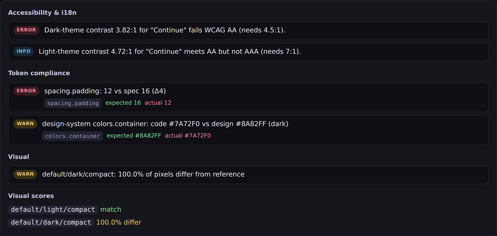
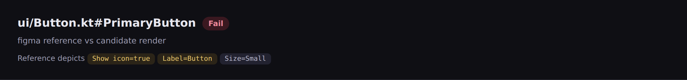
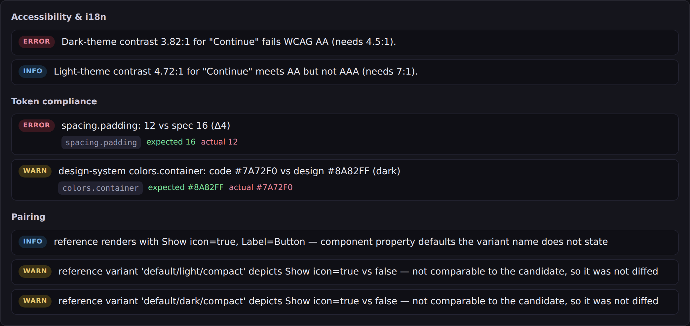

# Correspondence & token matching

How design-parity decides *which design a code preview should be compared
against*, and *how the design's colours and type styles line up with the
code's*. This documents what exists today, names the gaps, and proposes a
phased plan for the three open questions:

1. matching one code preview against a Figma node — or **several** nodes;
2. matching a **design token table** (a palette / type ramp) to code;
3. the **designless** case, where code must reference design elements and
   vice-versa because there is no machine link to lean on.

---

## 1. The moving parts

Two id namespaces meet in the middle, and a third (the design ref) hangs off
the code side:

| Namespace | Example | Owned by | Defined in |
| --- | --- | --- | --- |
| **preview id** | `ee.app.DeviceKt.DeviceBodyPreview` | compose-ai-tools | `CandidateRender.previewId` (`packages/core/src/types.ts`) |
| **code handle** | `ui/Device.kt#DeviceBodyPreview` | design-parity | `Correspondence.code`, `DesignMapEntry.code` |
| **design ref** | `figma:abc123/1:42`, `stitch:proj/screen`, `mocks/device.html` | the design source | `Correspondence.ref` |

The pipeline that joins them, for each changed component:

```
changed code ─▶ resolver ─▶ Correspondence{code, source, ref}
                               │
                               ▼
                     ReferenceAdapter.resolve(code, ref) ─▶ DesignReference
                                                              │  (images + tokens)
candidate render (CandidateRender) ───────────────────────────┤
                                                              ▼
                                                          diff engine
                                                   ├─ pairImages  (variant ↔ variant)
                                                   ├─ diffTokens  (token ↔ token)
                                                   └─ diffSemantics
```

Everything before the diff is **pure and deterministic** — no per-run model
calls (`docs/PRINCIPLES.md`, Principle 1). The resolver reads only committed
inputs; the adapters fetch/parse but don't *decide* correspondence.

---

## 2. Component matching: a preview ↔ a design reference

### 2.1 Preview id ↔ code handle (`packages/resolver/src/preview-id.ts`)

A preview-bundle / daemon candidate is keyed by `previewId`
(`<fqClass>.<function>`), but references are keyed by code handle
(`path#Member`). `codeHandleForPreview` bridges them, mirroring the resolver's
precedence:

1. **explicit** — a `design-map.json` entry whose `previewId` field names this
   preview → high confidence;
2. **convention** — `sourceFile#functionName` derived from the bundle's own
   metadata → low confidence.

Unmatched previews are reported (not silently dropped) so a missing link is
visible.

`previewId` mirrors `ref`: it accepts a single string **or** a list of
variant-tagged handles (`{ previewId, state?, theme?, size? }`), so a component
whose themes are authored as separate `@Preview`s binds them all to one code
handle. Each tagged preview's render is re-tagged onto its slot and merged, so
the report's theme matrix fills every column for one component (issue #111).

### 2.2 Code handle ↔ design ref (`packages/resolver/src/resolver.ts`)

`resolveComponent` picks `(source, ref)` in a fixed precedence; first hit wins:

1. **Code Connect** — Figma's machine link, indexed by code handle
   (`CodeConnectIndex`). Materialised in CI by the Figma CLI into a committed
   artifact, so the resolver stays call-free. → `linkMethod: "code-connect"`,
   confidence `high`.
2. **`design-map.json`** — the repo's committed manifest
   (`packages/core/src/design-map.ts`). → `linkMethod: "manifest"`, `high`.
3. **convention** — fold the member name to a key
   (`PrimaryButton` ≈ `primary_button` ≈ `Primary Button`) and match a design
   catalog. → `linkMethod: "convention"`, `low`. An **ambiguous** match (one
   name, several catalog entries) is left unresolved with a warning rather than
   guessed.

### 2.3 Per-source ref formats

Each `DesignSource` parses its own `ref` and normalises to a `DesignReference`
(images + optional tokens). The diff engine never sees source specifics.

| Source | Ref shape | Link | Reference comes from |
| --- | --- | --- | --- |
| `figma` | `figma:<fileKey>/<nodeId>` or a figma.com URL (`figma-ref.ts`) | code-connect / manifest | REST: node image + Variables (`normalize.ts`) |
| `stitch` | `stitch:<projectId>/<screenId>` (`stitch-ref.ts`) | manifest | Stitch SDK |
| `claude-design` | repo-relative path to a committed HTML export, **or a `.json` DTCG token artifact** (`claude-design/adapter.ts`) | manifest | embedded handoff manifest (rasterised), or a `/design-sync`-emitted DTCG document (token-only, no rasterise) |
| `bundle` | repo-relative path to a PNG folder / `.zip` + `manifest.json` (`bundle/adapter.ts`) | manifest | committed PNGs |

Note the asymmetry the user's question targets: **only Figma has a live REST
link**. Stitch and bundles remain "designless" in the sense that the binding is
a human-committed `design-map.json` entry — there is no authoritative pull from
the tool, so the *code* (via the manifest) must point at the design element.
Claude Design sits between the two since the **`/design-sync`** beta (2026-06):
there is still no read API to call at run time, but the terminal sync now
materialises a machine-readable design system in the repo, so the adapter's
input is *committed-but-machine-generated* rather than fully hand-authored. See
[claude-design-sync-impact.md](./claude-design-sync-impact.md).

#### One code, **multiple sources** (issue #106)

A code handle may bind more than one design source in the same run — declare one
`design-map.json` entry per source with the same `code` (e.g. the same screen
against both `stitch` and `claude-design`). The resolver fans the code out to one
correspondence per source (`findAllByCode`), and the orchestrator diffs each
independently, keying its report dir and landing-page row by `(code, source)` so
the two verdicts sit side by side instead of colliding. Failures stay fail-soft
per source. This is the head-to-head useful when **migrating between design
tools**: run the candidate against the old and new source at once and watch one
verdict converge as references move over. Code Connect still wins outright when
present, so multi-source applies to manifest-bound sources. See
[`examples/design-map.json`](../examples/design-map.json) (`ui/Card.kt#OfferCard`).

### 2.4 Gap — one preview, **multiple** design nodes

Today a `DesignMapEntry` has a single `ref`, and `parseFigmaRef` yields one
`{ fileKey, nodeId }`. So one code preview ⇒ exactly one design node. Real
screens don't work that way:

- a screen's **states** (default / pressed / empty / error) are often separate
  Figma frames;
- **light/dark** and **breakpoints** are separate frames;
- a composite preview may stitch several design components.

The image-pairing layer is already variant-aware (§3) — it keys on
`state|theme|size` — so the missing piece is purely *upstream*: letting one
code handle carry several refs, each tagged with the variant slot it fills.
See the plan, Phase 2.

---

## 3. Image / variant pairing (`pairImages`, `packages/diff/src/diff.ts`)

Once a `DesignReference` is resolved, its `referenceImages[]` are paired to the
candidate's `images[]` by `pairKey` = `state|theme|size`
(`packages/diff/src/visual.ts`): an **exact** key match first, then a **loose**
fallback (same state, size-compatible) so a missing theme/size tag still pairs.
Unmatched reference variants surface as findings rather than being dropped.

This is the layer that makes multi-node Figma refs (§2.4) cheap: every extra
node just fills another variant slot.

### 3.1 Pairing on component properties, not just on the variant key (issue #296)

The variant key names `state|theme|size`, and a component varies along axes it
does not name. Worse, the *reference render itself* is not neutral: Figma's
`GET /v1/images` renders a node at its component-property **defaults**, and
those defaults appear nowhere in the variant's name. The M3 kit's `Button` set
defaults `Show icon` to `true`, so a node named `Type=Round, Size=Small` renders
with an icon — and label-only code diffed against it reports a missing icon as
though the code were wrong.

The same pair, before and after. Before, the reference's icon is invisible to
the reader and the pair is diffed anyway — "100.0% of pixels differ" reads as a
defect in the code:



After, the report says what the reference depicts and why the pair was left
alone:





Three pieces close that:

1. **The reference says what it depicts.** The Figma adapter reads
   `componentPropertyDefinitions` — from the component **set**, since a variant
   carries none of its own, and only for nodes asked for **directly**, since
   Figma returns them for nothing reached by descending a page — and normalises
   them onto `DesignReference.properties` (`ReferenceProperty[]`). One extra
   batched read per file, not one per component. The report prints them under
   the title; the diff states the non-variant ones as an `info` finding, since
   those are the ones nothing else on the page mentions.
2. **A contradiction is a pairing problem, not a divergence.** When a candidate
   image declares a property (`Image.props`) the reference contradicts, the pair
   is reported `kind: "pairing"` and left **undiffed** — `warn`, never `error`,
   because the fix is a better reference and a blocking verdict would tell the
   consumer to change correct code. Candidate silence is not a claim: a
   candidate that says nothing about `Show icon` still diffs.
3. **A better node is preferred over a mismatch.** `ReferenceAdapter.resolveSibling`
   answers "the same component with one axis moved" (`Size=Small` →
   `Size=Medium`) by looking it up in the set's variant names, which *are* axis
   vectors. The orchestrator asks for it when the candidate claims a different
   variant, and diffs against what comes back. It returns `undefined` for every
   translation the source does not have — a confident reference to the wrong
   node is worse than none, because the diff that follows looks authoritative.

What stays out of design-parity: the consumer's own dialect — the map from *its*
preview knobs to the source's axis names (`size`→`Size`, `xs`→`XSmall`), and
which of its renders are single-axis rather than combinations. That is
catalog-shaped, and shipping one consumer's vocabulary as a contract would make
it wrong for every other consumer.

---

## 4. Token-table matching: colours & type styles ↔ code

This is the second half of the user's question — matching *a design table of
defined colours and font styles* to code — and it runs on a different axis from
image pairing.

### 4.1 Where the **reference** token table comes from

- **Figma** (`normalize.ts`): `colorsFromVariables` walks the file's Variable
  collections and emits `colors["<name>.<mode>"]` for every COLOR variable in
  every mode (e.g. `on-surface.light`). Aliases (variables pointing at other
  variables) are skipped — only concrete `{r,g,b,a}` values land. Typography
  comes from the first TEXT node's `style`. **This is the design token table.**
- **claude-design / bundle**: the table is whatever the committed handoff /
  `manifest.json` declares under `tokens` (a `DesignTokens` bag). For
  `claude-design` the ref may instead be a **`.json` DTCG token artifact** (a
  `/design-sync`-emitted design system); the adapter loads it through
  `loadDtcgTokens` into a token-only `DesignReference` — same loader as the
  committed-DTCG-file path below, but it *is* the reference, with no HTML export
  to rasterise (issue #149).
- **A committed DTCG file** (any source): a `design-map.json` entry can point
  `tokensFile` at a W3C DTCG document (Figma Variables export, Tokens Studio)
  read by `@design-parity/core`'s `loadDtcgTokens` (issue #89). The action loads
  it once up front (`loadSpecTokens`) and merges it over whatever the adapter
  resolved (declared values win), so a source that exposes no tokens still has a
  spec to diff against. DTCG names are matched via the Material-role heuristic
  (§4.3, issue #87).

### 4.2 Where the **candidate** token table comes from

- Per-node values are read from the compose semantics
  (`layoutForegroundColor`, `layoutFontSize`, `boundsInRoot`) in
  `packages/candidate/src/daemon.ts` and attached to each `SemanticNode.tokens`.
- The **resolved design system** behind the render — the full palette, the
  Material type styles, corner radii — arrives as `compose/theme.resolvedTokens`
  and is exposed as `SemanticTree.themeTokens`
  (`packages/core/src/types.ts`). **This is the code token table.**

### 4.3 How matching works today (`packages/diff/src/tokens.ts`)

`collectTokens` flattens the candidate semantics tree into one `DesignTokens`
bag (children override parents), and `diffTokens` compares it to the reference
spec **by token name**: numeric tokens honour a tolerance, typography is exact,
colours match modulo a full-alpha suffix and — when the candidate couldn't
*name* a colour — fall back to a same-role value match (issue #74).

Colours are matched in three tiers, most precise first: (1) **exact name** —
the explicit alias map has already canonicalised design names to code names
(§4.4, issue #78); (2) **Material role** — a reference token *named in
design-system vocabulary* (`color/on-surface`) is recognised as the Material 3
role it denotes (`onSurface`) via `@design-parity/core`'s `materialColorRole`
and matched against the candidate's resolved role (compose-ai-tools#1897, issue
#87); (3) the #74 **same-role value** fallback (`fg`/`bg`). The role tier is a
low-confidence *name* match, so a mismatch found that way is flagged
`via: "role-heuristic"` in the finding detail. Typography gets the analogous
type-scale heuristic (`type/body/large` → `bodyLarge`).

When all tiers miss, severity depends on whether we could map the token at all
(issue #102): a colour/typography token that maps to a Material role the
candidate genuinely lacks is a real gap → hard `error`; one that maps to **no**
role (`brand/blue-600`, `label`) is unverifiable, not proof the candidate is
wrong → a non-blocking `info` advisory (`detail.unmapped`).

Numeric spacing/radius take the same treatment for the *absent* case (issue
#368). A numeric has no role taxonomy to be unmappable in, so once the exact
name, the value match, and — for an inset — the measured geometry have all
missed, there is simply no candidate value to compare: `info` with
`detail.unverified`, the per-token counterpart of the group-level
"candidate resolved no <group> tokens" note. **A value the candidate *does*
report stays strict** — that comparison is the one worth running, and a
mismatch is still a hard `error`. Wear is the case that forced it: a component
inset by `touchTargetAwareSize` plus a sized child declares no padding modifier
at all, and adding one purely to clear the check would make the code a less
faithful reproduction of the library. A repo that wants the old behaviour sets
`tokens.missingNumerics: "strict"` in `.design-parity.json`.

An **inset** spec gets one more attempt before that: `collectDerivedInsets`
measures the gap between a container's bounds and the union of its children's,
so a candidate that draws the spec'd inset by centring rather than by a padding
modifier is compared like with like (issue #364). That proxy holds when the
child is a box and breaks when it is **text** — a glyph run's box is as wide as
the string and as tall as its line height, so the "inset" measured around it is
font metrics, and quoting it against a declared auto-layout padding invents a
divergence (issue #367). Any container whose measured edge is *set* by a text
child is therefore dropped rather than reported; all four edges must agree for
an inset to be reported at all, so one glyph-set edge calibrates the whole
number. `tokens.textDerivedInsets: "measure"` restores the unfiltered
behaviour.

That rule, stated only over the candidate's own tree, is wider than the fault it
names: a container whose single child is its label is the same shape whether the
gap around the glyph is font metrics or the padding the parent chose, so it
discarded true insets with false ones and failed a card drawing exactly what the
kit specs (issue #371). The reference settles it. `referenceInsets` measures the
**reference's** geometry with the same rule — rebuilding containment from the
boxes, since the Figma capture is a flat list — and a glyph-set candidate edge is
readmitted when the reference independently measures the same inset within
`spacingTolerance`. Only a reference inset its own *boxes* establish counts; two
fonts agreeing is not a layout, and a reference that states its own hierarchy is
taken at its word rather than re-parented by enclosure.

Corroboration is one-directional by design: a glyph-set edge can **acquit but
never convict**. The corroborating value is one the reference draws somewhere,
not necessarily on the node the spec describes, so a readmitted measurement is
marked as such and the comparison will not quote a Δ off it — a candidate that
declares no padding, draws a 12dp glyph gap and meets a `padding: 16` spec stays
`unverified` rather than newly failing because something unrelated in the kit
insets 12.

The #74 fallback is the tell that the **naming** is the weak link: when the
code's theme can't name a value, the colour lands under a generic role key
(`fg`/`bg`) instead of `onSurface`, and a name-keyed comparison misses it. The
role heuristic and the explicit alias close most of this gap; the value fallback
remains for the unresolved-theme case.

### 4.4 Gaps

1. **No alias layer.** Figma names a variable `color/on-surface`, the code
   names it `onSurface`, a bundle might call it `text.primary`. Nothing maps
   these vocabularies, so matching is either exact-name luck or the role/value
   heuristic.
2. **No design-system-level audit.** `themeTokens` (code) and the Figma
   Variables table (design) are both *whole tables*, but they're only ever
   consulted per-screen, to name a node's colour. There is no check that diffs
   "the design system's palette/type ramp" against "the code theme's", once,
   independent of any one screen.

---

## 5. Designless, and the bidirectional binding

> *assume if it's designless that we need the code to reference the design
> elements and vice versa.*

"Designless" spans two situations:

- **No design system at all** (maturity rung `bootstrap`,
  `packages/baseline/`): setup seeds an opinionated token baseline and the
  candidate render becomes its own reference. The "design elements" are the
  seeded token names; parity then means *the code keeps using those names with
  those values*.
- **A design exists but has no machine link** (Stitch, Claude Design, bundle):
  the only binding is the committed `design-map.json`, which today points one
  way — **code → design** (`code` ⇒ `ref`, optional `previewId`).

The user's requirement is that the binding be **explicit and bidirectional**
whenever the machine link is absent:

- **code → design**: a preview/component declares which design element and
  which design tokens it realises. Partly present: `design-map` `ref` +
  `previewId`. Missing: token-level binding (which design token each code token
  implements).
- **design → code**: a design element declares which code handle implements it.
  Figma Code Connect does this from the design side; for the designless sources
  there is no reverse index, so a designer can't ask "what renders this frame?"

The shared, tool-independent vocabulary that makes both directions resolvable
is the **token name**. That's why the alias layer in §4.4 is the keystone for
the designless case, not just a colour-matching nicety: it is the contract both
sides reference.

---

## 6. Plan

Phased so each step is independently shippable and the earlier ones de-risk the
later.

> **Status: all four phases shipped** (#80, #83, #93, #94). The notes below are
> the plan as written; each phase header records where it landed and any way the
> implementation diverged.

### Phase 1 — Token alias map (foundation)

**✅ Shipped — #80** (closes #78).

Add an optional alias layer binding design token names ↔ code token names.

- Extend `design-map.json` (or a sibling `token-map.json`) with a `tokens`
  section:

  ```jsonc
  {
    "tokens": {
      "colors":     { "onSurface": "color/on-surface" },   // code ⇄ design
      "typography": { "bodyLarge": "type/body/large" }
    }
  }
  ```

- Teach `diffTokens` to canonicalise both sides through the alias before
  comparing, replacing the #74 role/value heuristic with a real name mapping
  (the heuristic stays as the last-resort fallback).
- **Bidirectional for free:** the same table inverts to answer "which code
  token is this design variable?" — the design→code direction §5 needs.

*Touches:* `core/design-map.ts` (+schema), `diff/tokens.ts`. Pure, fully
unit-testable.

### Phase 2 — Multi-node design references

**✅ Shipped — #83.** Landed without touching the adapters: a `resolveReference`
helper in `packages/action` resolves each variant-ref and re-tags the images,
so the diff engine and every adapter stayed unchanged.

Let one code handle bind several design nodes, each tagged with the variant
slot it fills.

- Allow `DesignMapEntry.ref` to be a list of `{ ref, state?, theme?, size? }`
  (keep the string form as the single-default-variant shorthand).
- Resolve each into a `referenceImages[]` entry (and merge tokens); the
  existing `pairImages` keys (§3) then line each design frame up with the
  matching candidate variant with no diff-side change.
- Figma URL parsing already tolerates `node-id`; extend the manifest grammar
  and `parseFigmaRef` callers to accept the list.

*Touches:* `core/design-map.ts` (+schema), `resolver`, `adapters/figma`,
`adapters/*` image assembly. No change to the diff engine.

### Phase 3 — Design-system token-table audit

**✅ Shipped — #93.** `DesignReference.themeTokens` now carries the design-system
palette (the Figma adapter splits Variables into it); `diffDesignSystem` audits
it mode-aware against `SemanticTree.themeTokens`, and `orchestrate` dedupes the
findings so each drift is reported once per run. v1 covers colours; typography /
numeric system tokens are a follow-up.

A once-per-run check that diffs the **whole** design token table against the
code theme table, independent of any screen.

- Compare the Figma Variables table (`colorsFromVariables`, plus a type ramp)
  against `SemanticTree.themeTokens`, keyed through the Phase 1 alias.
- Emit `token`-kind findings at the design-system altitude ("palette drift:
  `onSurface` is `#161D1B` in Figma, `#101413` in code") so a single mismatch
  is reported once, not once per screen that uses it.

*Touches:* a new check in `packages/checks` or `packages/diff`; consumes
existing `themeTokens` + Figma Variables, no new extraction.

### Phase 4 — Reverse index for designless sources

**✅ Shipped — #94.** Both halves: `buildReverseIndex` in `packages/resolver`
inverts the manifest + Code Connect to `ref → code[]`, and the baseline seed
scanner harvests a code-authored `@DesignRef("…")` annotation (or a
`design-ref:` comment) into real `design-map.json` entries.

Make the design→code direction resolvable without Code Connect.

- Derive a reverse index (`ref` → `code`) from `design-map.json` so a Stitch /
  Claude-Design / bundle element can answer "what implements me?".
- Optional code-side annotation (e.g. a `@DesignRef("figma:…")` /
  KDoc tag) that setup can harvest into the manifest, so the **code** authors
  the binding and the manifest stays generated — the explicit "code references
  the design element" half of §5.

*Touches:* `resolver` (reverse index), `baseline`/setup (annotation harvest).

### Sequencing

Phase 1 first — it unblocks 3 and 4 and retires the #74 heuristic. Phase 2 is
independent and can land in parallel. Phase 3 depends on 1. Phase 4 depends on
1 (for the token half) and is otherwise standalone.

This is the order the work shipped in: #80 (1) → #83 (2) → #93 (3) → #94 (4).
