# `@design-parity/figma-plugin`

The in-Figma client for design-parity's **code → design** direction. It imports
a published `@design-parity/catalog-export` catalog — a compose-preview-rendered
component system: sticker-sheet PNGs plus a DTCG token set — straight onto a
Figma canvas as authoritative renders, grouped by component group, with:

- the **`ideal` render or the `layout` wireframe** variant (a UI toggle);
- an a11y **greenline** layer over the ideal render (touch-target, contrast,
  label findings from the catalog) — design-parity leads with a11y;
- a **redline** (spacing spec) layer over the layout wireframe — per-node box,
  padding, gap, and corner radius;
- a **variable collection** projected from the design system's tokens
  (light/dark become Figma modes);
- a **`design-map.json` correspondence** scaffold linking each code component to
  the frame the plugin just placed (see *Correspondence export* below).

Each variant gets its natural overlay: greenlines annotate the *ideal* render,
redlines annotate the *layout* wireframe. Figma is a *view* of the code, never
the source of truth — the same stance the upstream catalogs and the Figma
roundtrip take. The render is authoritative; the plugin only places it.

| Ideal variant — a11y greenlines | Layout variant — spacing redlines |
| --- | --- |
| 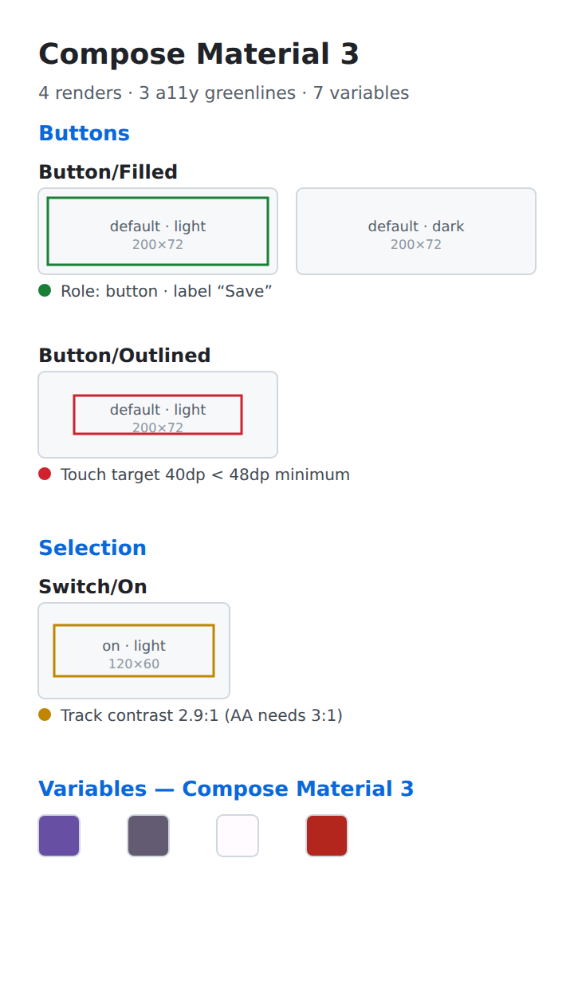 | 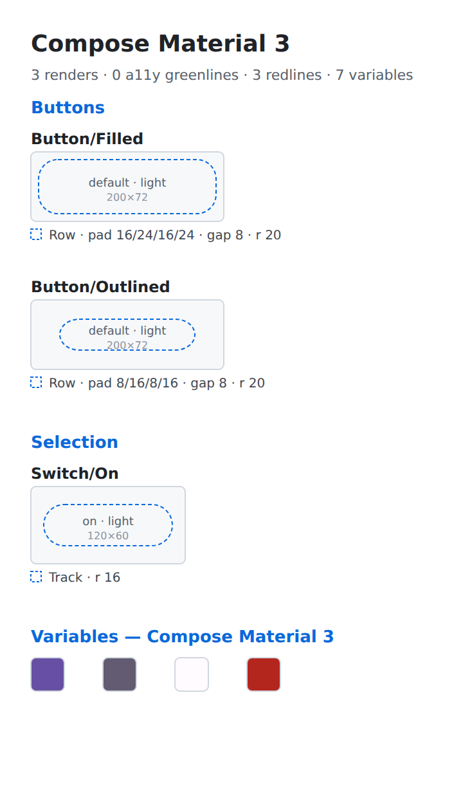 |

*Deterministic SVG proofs of the imported scene (`planToSvg`), rendered from the
shared [`docs/sample-catalog.json`](docs/sample-catalog.json) fixture. A Figma
plugin can't be rendered headlessly, so these stand in for canvas pixels in
review; regenerate with `npm run preview` (see [Keeping evidence
current](#keeping-evidence-current)).*

## Status

This package is **private** and ships to the **Figma Community**, not npm — a
Figma plugin is built-and-uploaded, so it carries no npm version tag and is
excluded from the release-please publish lane. `"version"` tracks the monorepo
for coherence only.

## Install in your local Figma

You don't need the repo, `npm`, or a Community listing to run this — a
locally imported plugin needs no plugin `id`, no publish, and no review. Grab
the prebuilt, self-contained bundle and import it:

1. **Download the bundle.** Either the `design-parity-figma-plugin.zip` asset on
   the [latest release](https://github.com/yschimke/design-parity/releases/latest),
   or the `figma-plugin` artifact from a recent
   [`figma-plugin-bundle`](https://github.com/yschimke/design-parity/actions/workflows/plugin-bundle.yml)
   run. Unzip it — you get a folder with `manifest.json`, `code.js`, and
   `ui.html`.
2. **Import it.** In the Figma **desktop** app: *Plugins → Development → Import
   plugin from manifest…* and pick the unzipped `manifest.json`.
3. **Run it.** *Plugins → Development → design-parity — Catalog Import.*

That's it — it stays a private development plugin on your machine. (Importing
from a manifest is desktop-only; the browser app can't load local plugins.)

Publishing to the **Figma Community** is a separate, manual step — see
[Publishing](#publishing-to-the-figma-community) — and *does* require
registration.

## Layout — two realms, one testable core

A Figma plugin runs in two sandboxes: a **main thread** with the `figma` scene
API but no network, and a **UI iframe** with `fetch`/DOM but no scene access.
Neither is unit-testable under Node. So all the decision logic lives in a pure
core and the two runtime files stay thin:

| Path | Realm | Role |
| --- | --- | --- |
| [`src/plan.ts`](src/plan.ts) | pure (tested) | `buildImportPlan(manifest, opts)` → an `ImportPlan` describing every frame, image URL, greenline/redline, and the Figma variable collection. No `figma`, no `fetch`. |
| [`src/localCatalog.ts`](src/localCatalog.ts) | pure (tested) | `stripLocalRoot(path)` + `rewriteManifestAssets(manifest, urlFor)` — load a catalog from a **local folder** (offline) by rewriting its asset paths to `blob:` object URLs the existing fetch-based flow reuses. No `figma`, no `fetch`. |
| [`src/liveBridge.ts`](src/liveBridge.ts) | pure (tested) | `liveBridgeTarget(id, system, livePreviewUrl?)` + `matchPreview(previews, target)` — the **catalog → live** handoff: derive the server/system/preview to tee up in the Override editor from a picked component (using the catalog's `livePreview` deep link when present, else a fuzzy match). No `figma`, no `fetch`. |
| [`src/catalogPick.ts`](src/catalogPick.ts) | pure (tested) | `indexCatalog(manifest)` → the **single-component** picker's view model (each component's variant + dimension axes); `groupComponents(index, query)` → the search-filtered, group-bucketed list behind the picker dropdown; `selectCatalogImage(manifest, selection, base)` → the one image a `PickSelection` resolves to; `componentSetCells(manifest, id, base)` → the variant cells for a native component-set insert. The selective counterpart of `buildImportPlan`. No `figma`, no `fetch`. |
| [`src/insert.ts`](src/insert.ts) | main-thread logic (tested) | `placeCatalogPng` / `placeCatalogSvg` / `placeCatalogComponentSet` — place one picked component as a raster render, the wireframe vector, or a native **component set** (all variants), stamped with its identity (no refresh source; a catalog render is static). Injected `FigmaApi`, so it runs headlessly. |
| [`src/svgRaster.ts`](src/svgRaster.ts) | pure (tested) | `svgRasterHrefs(svg)` / `inlineSvgRasters(svg, map)` — find and inline a design vector's external raster crops as `data:` URIs so Figma's `createNodeFromSvg` can place a hybrid `compose/figma-svg` sticker. No `figma`, no `fetch`. |
| [`src/nativeSvg.ts`](src/nativeSvg.ts) | pure (tested) | Prepare editable vectors for native Figma import: clamp SVG pill radii to native rectangle radii, read font/token hints, and conservatively infer Auto Layout rows/columns from geometry. |
| [`src/spec.ts`](src/spec.ts) | pure (tested) | `buildFrameSpec(read, opts)` → a `FrameSpec` (kind: new / edit / screen, target id, referenced components) from a selected frame's structural read; `specToIssueBody` / `specToJson` render the **Propose spec** artifacts (design→code). Bakes in the a11y + i18n acceptance contract. No `figma`, no `fetch`. |
| [`src/serverHelp.ts`](src/serverHelp.ts) | pure (tested) | `diagnoseServerLoad(outcome)` → an educational `ServerHelp` (title + detail + fix-it steps) when the Override editor can't reach a `compose-preview serve` host — unreachable / HTTP error / non-serve host / empty system. No `figma`, no `fetch`. |
| [`src/dtcg.ts`](src/dtcg.ts) | pure (tested) | Slim, browser-safe DTCG token reader (core's `readDtcgTokens` is Node-only — it loads the schema from disk). |
| [`src/preview.ts`](src/preview.ts) | pure (tested) | `planToSvg(plan)` → the offline SVG layout proof used for review evidence. |
| [`src/designMap.ts`](src/designMap.ts) | pure (tested) | `buildDesignMap(plan, {fileKey, nodeIds})` → the `design-map.json` correspondence, validated against `@design-parity/core`'s schema. |
| [`src/annotations.ts`](src/annotations.ts) | pure (tested) | Shared colour + label helpers for the greenline (severity) and redline (spacing spec) layers — one place so the SVG preview and Figma paints match. |
| [`src/reconcile.ts`](src/reconcile.ts) | pure (tested) | `reconcile(existing, plannedIds)` → the update/add/stale decision for a re-import, keyed by `componentId`. No `figma`. The decision half of non-destructive re-import; `scene.ts` executes it. |
| [`src/direction.ts`](src/direction.ts) | pure (tested) | `resolveDirection(raw)` → `code-led` \| `design-led` (unresolved ⇒ design-led, the safe default). The mode gate: design-led routes renders to a reference page and requires confirm-before-write. |
| [`src/scene.ts`](src/scene.ts) | main-thread logic (tested) | `applyImport(figma, plan, images)` — **stamps** every node with its identity and either builds a fresh page or **reconciles** an existing stamped board in place; image fills, greenline/redline overlays, variable collection; emits the `design-map.json`. Takes an **injected** `FigmaApi`, so it runs headlessly against a fake (see [Testing before Figma](#testing-before-figma)). |
| [`figma/ui.ts`](figma/ui.ts) | UI iframe | Fetches `catalog.json` + tokens + PNG bytes, runs the planner, posts the plan to the main thread. |
| [`figma/code.ts`](figma/code.ts) | main thread | Thin bootstrap: wires the UI and hands the real `figma` to `applyImport`. |
| [`figma/ui.html`](figma/ui.html) | UI iframe | Markup; esbuild inlines the compiled `ui.ts` into it. |
| [`figma/manifest.json`](figma/manifest.json) | — | Figma plugin manifest (network allowlist, entry points). |

The pure core is the package's exported surface (`src/index.ts`); the `figma/`
glue depends on the `figma` global and is bundled by esbuild, never imported by
Node.

### Why the `catalog-export/figma` subpath

`buildImportPlan` reuses `toFigmaVariables` from
[`@design-parity/catalog-export/figma`](../catalog-export/src/figma.ts) — the
package's browser-safe Figma-projection subpath — **not** the package barrel.
The barrel re-exports the on-disk catalog writer (`node:fs`), which can't be
bundled into a Figma plugin. The subpath keeps the browser bundle Node-free by
construction.

## Build

```sh
npm run build   --workspace @design-parity/figma-plugin   # tsc: the pure core → dist/
npm run test    --workspace @design-parity/figma-plugin   # vitest: planner, dtcg, preview, scene
npm run build:plugin --workspace @design-parity/figma-plugin  # esbuild: figma/ → figma/dist/plugin/
npx tsc -p packages/figma-plugin/figma/tsconfig.json          # type-check the real Plugin API glue
```

`build:plugin` emits `figma/dist/plugin/` as a **self-contained, importable
bundle**: `code.js`, a self-contained `ui.html`, and a flattened `manifest.json`
(entrypoints rewritten to `./code.js` / `./ui.html`). That's exactly what the
[`figma-plugin-bundle`](../../.github/workflows/plugin-bundle.yml) workflow zips
and ships (see [Install in your local Figma](#install-in-your-local-figma)).

To load it from the source tree, import either manifest in the Figma **desktop**
app (*Plugins → Development → Import plugin from manifest…*):

```text
packages/figma-plugin/figma/manifest.json            # dev entry (points at ./dist/plugin)
packages/figma-plugin/figma/dist/plugin/manifest.json # the flattened bundle
```

Both work after a build; the dev entry is the one to keep loaded while iterating.

## Testing before Figma

A complete Figma document cannot run under Node, so the scene the plugin builds
is verified **headlessly** before it's ever loaded in Figma. The main-thread logic lives in
[`src/scene.ts`](src/scene.ts) as `applyImport(figma, plan, images)`, which takes
the scene API as an **injected** `FigmaApi` (a structural subset of Figma's
`PluginAPI`). [`test/scene.test.ts`](test/scene.test.ts) drives it against a fake
([`test/fakeFigma.ts`](test/fakeFigma.ts)) that records every created node,
image, variable, and font load, then asserts the exact tree — frame hierarchy,
image fills, greenline/redline rects and their strokes, the variable collection's
modes + values, and the emitted `design-map.json`. This catches wrong API calls,
ordering, and null handling (e.g. an unsaved file's `fileKey`) up front.

The post-SVG Figma-runtime transforms are covered at the same boundary in
[`test/nativeSvgRuntime.test.ts`](test/nativeSvgRuntime.test.ts). Its focused
Plugin API double proves that a padded list becomes an exact-size vertical Auto
Layout frame, overlapping artwork remains absolute, and a Compose pill vector
is replaced in-place by an appearance-preserving native rectangle. The pure
geometry, font, token, slot, and mapped-upgrade planners have separate tests.

What's left for a manual Figma smoke test is only genuinely runtime-specific:
real font metrics, image decoding, and Figma's auto-parenting. To run it, feed
the plugin a catalog without publishing anything: serve a fixture directory
locally (`npx serve ./catalog`) and add `"http://localhost:*"` to the manifest's
`networkAccess.devAllowedDomains` (dev-only), or point it at a
`raw.githubusercontent.com` branch already in `allowedDomains`.

## Using it

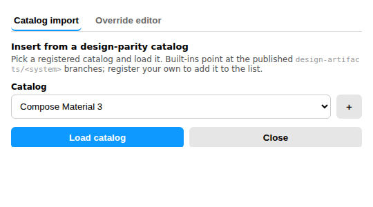

Run the plugin and pick a catalog from the **Catalog** dropdown. Three are built
in — **Compose Material 3**, **RemoteCompose Material 3**, and **Wear Material
3** — each pointing at its published `design-artifacts/<system>` branch. Your
last pick is remembered across sessions (persisted in `figma.clientStorage`), so
the dropdown re-opens on the catalog you used last.

### Register your own catalog

Press **＋** to register another catalog: give it a name and the raw root of its
published bundle (the folder containing `catalog.json` — do *not* append
`/catalog.json`; the plugin does that itself). It's added to the dropdown,
selected, and persisted; the **🗑** button removes a custom catalog (the built-ins
can't be removed). Only hosts in the manifest's `networkAccess.allowedDomains`
(`raw.githubusercontent.com` and the `preview.coo.ee` demo by default) can be
fetched — add your own live-preview host there to register a `compose-preview
serve` catalog.

Press **Load catalog**. The plugin fetches the manifest (and its DTCG token
file) and reveals two ways to bring the system onto the canvas — insert *one*
component, or import the whole sheet.

### Load from a local folder (offline, no server)

Browsing and inserting a catalog **doesn't need a server or even a network** —
only the Override editor's live customization does. **Load folder…** reads a
catalog straight from a local `design-artifacts` directory (the folder holding
`catalog.json`) that you picked: each file becomes a `blob:` object URL, the
manifest's asset paths are rewritten to those URLs, and — because
[`resolveImageUrl`](src/plan.ts) passes `blob:` through — every insert/import
fetches the local bytes with the exact same flow as a remote render. So a
freshly generated catalog drops into Figma with zero setup.

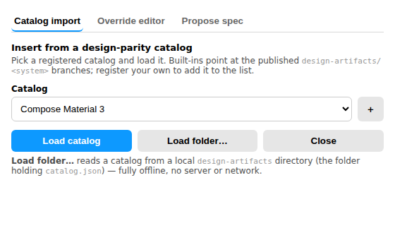

### Insert one component (selective)

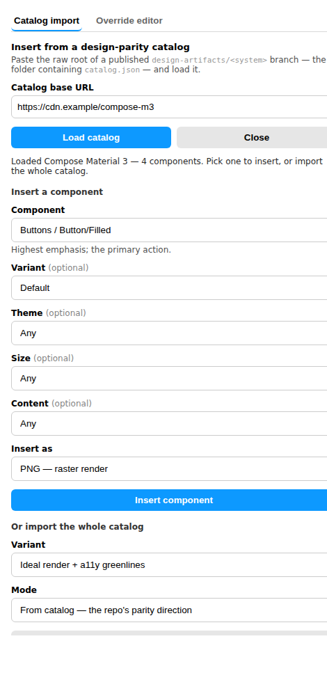

Instead of dumping the entire catalog, pick exactly what you want:

- **Component** — any component in the loaded catalog. The dropdown is **grouped
  by component group** (`<optgroup>`) and has a **search box** above it that
  filters live by id, caption, or group — so a large catalog stays navigable.
- **Variant** *(optional)* — the component's own state axis (`default`,
  `pressed`, `disabled`, …). Hidden when the component has a single state.
- **Dimensions** *(optional)* — the presentation axes the catalog actually
  carries for that component: **theme**, **size**, any extra `props` axis
  (e.g. **content** = `icon+label`), and the **i18n dimensions** below when the
  catalog renders them. These are **data-driven per catalog** — a system
  rendered only light/dark exposes just a Theme dimension; one rendered across
  breakpoints/locales/font-scales exposes those too — so the picker only ever
  offers combinations that exist. Any dimension left on **Any** is a wildcard
  (the first matching render is used).

  The i18n axes (from the render matrix, design-parity #220) get friendlier
  labels and a short "what this checks" caption so a designer can eyeball
  truncation / mirroring / dynamic-type risk **at design time**:

  | Axis (`props` key) | Label | Checks | Example values |
  | --- | --- | --- | --- |
  | `locale` | Locale | text expansion / truncation | `en`, `ar`, a pseudolocale (`en-XA`) |
  | `direction` | Direction | RTL mirroring | `ltr`, `rtl` |
  | `fontScale` | Font scale | dynamic type | `1.0`, `1.5`, `2.0` |

  They surface automatically wherever the catalog emits them — no per-system
  wiring — and any other `props` axis still appears with its generic label.

  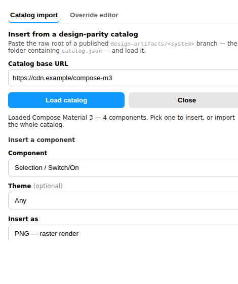
- **Insert as** — **PNG** (the shipping raster render for the chosen
  variant/dimensions, a fixed-size raster) or **SVG** (the component's **editable
  design vector** — the `compose/figma-svg` export at `figma/<slug>.svg`, which
  **scales crisply to any size**). The SVG path prefers the design vector and
  **falls back to the schematic wireframe** when a design vector isn't published;
  a hybrid sticker's raster crops are inlined as `data:` URIs so Figma can place
  it (`createNodeFromSvg` can't fetch external hrefs). SVG is offered whenever the
  catalog ships a vector for the component.

  The SVG import is upgraded to Figma-native structure where the source is
  losslessly representable:

  - pills/circles become rectangles with editable corner radii instead of paths;
  - the catalog palette is created or reused as a local variable collection,
    and matching fills, strokes, radii, padding, and gaps are bound to the named
    variables (including light/dark modes);
  - referenced local font faces are loaded before Figma parses editable text;
    unavailable families are reported instead of being silently treated as
    correct;
  - symbolic typography roles become reusable local Text Styles and are bound
    where the imported metrics identify one role unambiguously;
  - groups with a full-size background become native frames; clear rows and
    columns become Auto Layout with inferred per-edge padding and item spacing;
  - the inserted root becomes a native main component when Figma permits it.

  Freeform/overlapping vector artwork remains absolute layout, and elliptical or
  non-uniform corners remain paths: promoting either would change the visual.

**Insert component** places just that one node on the current page, stamped with
its `componentId` (so it's identifiable) but with no refresh source — a catalog
render is a static, published artifact.

**Insert all variants (set)** places the *whole* component as a native Figma
**component set** instead — one editable per-variant SVG `COMPONENT` per render,
named with its native variant properties (`state=…, theme=…, size=…, locale=…,
direction=…, fontScale=…`), combined into one set. A missing variant SVG falls
back independently to its PNG, rather than making the whole set fail. Common
text layers become native TEXT component properties. The component description
leads with the catalog's accessibility/i18n notes, source and live-preview links
appear in Dev Mode, and the relaunch action opens it back in Design Parity.

Structured live containers are promoted to main components when possible, so
declared child regions use Figma's native SLOT nodes; exact-size frames remain
the compatibility fallback. The set carries every `ideal` render the catalog
ships, making its stress-test matrix a reusable library asset.

### Import the whole catalog (sticker sheet)

**Or import the whole catalog** is the original bulk flow. Pick the **Ideal
render** (with a11y greenlines) or the **Layout wireframe** (with spacing
redlines) variant and the **Mode**, then Import. The plugin fetches every PNG for
that variant and lays out a `<system> — Catalog` page with the matching
annotation layer and a variable collection (light/dark become Figma modes),
reconciling in place on re-import (see below).

### Bulk-upgrade a legacy import

After loading the matching catalog, choose the committed `design-map.json` under
**Upgrade an existing mapped import**, then click **Bulk upgrade mapped nodes**.
The map—not layer-name guessing—selects the old PNG/basic-SVG roots in the
current Figma file. Explicit scalar or variant-tagged Compose `previewId`s are
matched against the source id retained on each catalog render; older generated
maps fall back to their deterministic code handles. Each root is replaced with
the same editable per-variant component
set used by a fresh import, while retaining its canvas position, rotation, parent
order, and name.

The upgrade is intentionally non-destructive around live library use: stale,
cross-file, ambiguous, already-current, and unsupported mappings are reported and
left untouched; a component with existing instances is skipped so instance
overrides cannot be broken. Successful replacements change node IDs, so the
plugin returns an updated correspondence document to copy back over
`design-map.json`.

### Live customization needs a server

The **Override editor** tab renders on demand (any size, any knobs), which needs
a running [`compose-preview serve`](../../docs/design-artifacts) host —
customizing + rendering Compose can't happen offline. When the plugin can't reach
one, it doesn't just say "failed to fetch": it explains what's missing, how to
start a host, and that browsing/inserting published renders on the **Catalog
import** tab works with **no server at all**.

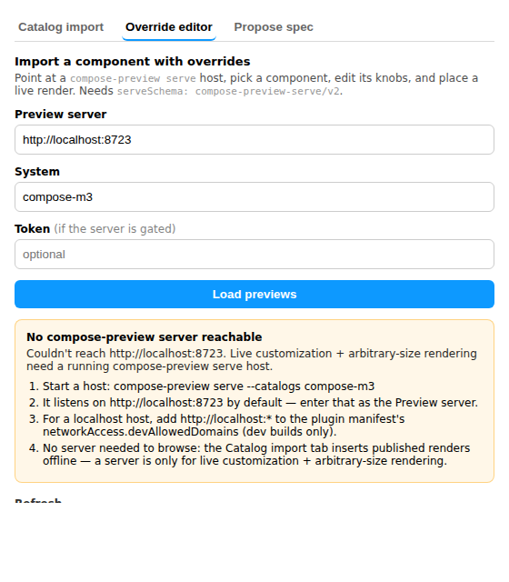

## Customise live — the catalog → editor bridge

Catalog renders are *baked* (fixed sizes/variants). To customise a component —
tweak knobs, render at an arbitrary size — you need the live Override editor.
**Customise live →** on a picked component bridges the two: it hands the
component to the Override editor, prefilling the **server** and **system** from
the catalog's `livePreview` deep link (when the catalog carries one — otherwise
just the system, and you supply the host), switches tabs, loads previews, and
**auto-selects** that component so you land ready to tweak + size + place. So
browsing flows straight into live customization instead of re-entering
everything by hand.

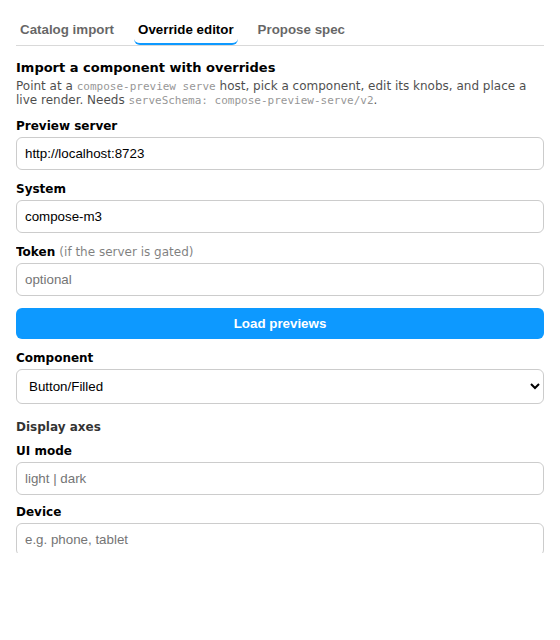

## Re-render at the desired size (live)

A placed **live render** (from the Override editor) is a raster, so scaling it up
blurs. When you've dragged it to the size you actually want, **Refresh → At
current size** re-renders it at its on-canvas dimensions: the plugin pins
`widthPx` / `heightPx` (via [`withRenderSize`](src/render.ts)) from the node's
current width/height and re-fetches, so the `compose-preview serve` host
**re-lays-out** the component for that size — not just rescales the old pixels —
and the node remembers the size for later refreshes. (For a *catalog* render that
should scale losslessly, insert it as **SVG** instead.)

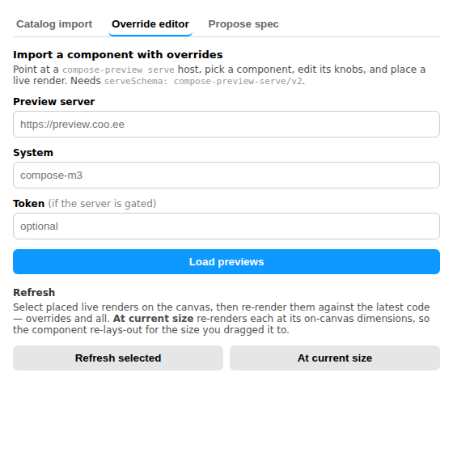

## Propose a spec → issue (design → code)

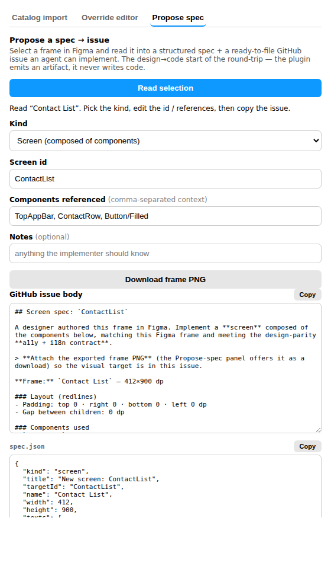

Every other flow here is **code → design** (render code, place it in Figma). The
**Propose spec** tab is the *other* direction — the design → code *start* of the
round-trip. Select a frame in Figma, press **Read selection**, and the plugin
reads its name, size, auto-layout redlines (padding / gap / corner radius), text,
and the **component instances it's built from** into a structured spec.

A proposal isn't always an edit to one component, so you pick a **Kind**:

- **New component** — build a brand-new component from this frame;
- **Edit existing component** — update a component that already exists;
- **Screen** — a screen composed of several components (auto-suggested when the
  frame uses ≥2 components).

The components the frame instantiates are detected and prefilled into
**Components referenced** (editable) — carried as *context* for the implementer,
not collapsed into the target. From that the plugin renders:

- a **GitHub issue body** (Markdown) — kind-aware framing, the frame, its redlines
  and text, the **components it uses**, and the design-parity **a11y + i18n
  contract as an acceptance checklist** (WCAG AA contrast, 48dp targets, text
  expansion, RTL, no hardcoded strings, dynamic type), plus a correspondence note;
- a `spec.json` artifact;
- the exported frame **PNG** (a download) to attach to the issue.

Consistent with the repo's *verify, don't generate* stance
([`PRINCIPLES.md`](../../docs/PRINCIPLES.md) §1), the plugin **emits an artifact,
it never writes code** — you open the issue (or hand the body + PNG to an agent
session to file), an agent implements it, and once the catalog regenerates the
render lands back beside the frame, closing the loop. This is the first slice of
[#222](https://github.com/yschimke/design-parity/issues/222); token/variable
capture and automated routing-back are tracked there.

### Re-import reconciles in place — identity, not position

Importing the same system again is **not** a delete-and-rebuild. Every node the
plugin creates is stamped with invisible shared plugin data (`designParity`)
recording its role and, on each card, the catalog `componentId`. A re-import
finds the existing `<system>` board by that stamp and **reconciles** against it,
keyed by `componentId` (not by position, so a card a designer moved or regrouped
still matches):

- **matched** → the card's renders are refreshed on the *same* node, keeping its
  id, position, and any designer edits;
- **new in the catalog** → a card is added into its group;
- **gone from the catalog** → the card is tagged `stale` (name prefixed
  `(stale)`), never deleted;
- **unstamped** nodes — a designer's own content — are never touched.

The update/add/stale decision is the pure [`reconcile`](src/reconcile.ts).

### Mode-aware — code-led vs design-led

Who owns the file decides how the import behaves (the parity direction, resolved
by [`resolveDirection`](src/direction.ts) — only an explicit `code-led` lets the
importer own the file; `design-led`, an unresolved `auto`, or anything unknown is
treated as design-led, so an uncertain direction never clobbers a designer):

- **Code-led** (code is the source of truth): the plugin owns the
  `<system> — Catalog` page and builds / reconciles it directly, as above.
- **Design-led** (Figma is the source of truth): renders are a **comparison
  reference** only. They go onto a dedicated **`Code renders (reference)`** page,
  kept separate from the code-led catalog board (stamped `mode`, so one never
  reconciles into the other), and the plugin **refuses to write until you
  confirm** — the first Import is a dry run that reports what it *would* place,
  and a **Confirm write** button commits it. It never restructures
  designer-owned content unasked.

The direction is **stamped into `catalog.json`** by the generator from the
consumer repo's `.design-parity.json` (`generate-design-catalog.mjs` →
`toCatalogManifest`'s `direction`). The plugin's Mode selector defaults to
**From catalog** and honours it (a set-up repo has materialized a concrete
`code-led`/`design-led`; an unresolved `auto` or absent field falls back to the
safe design-led default), with **Code-led** / **Design-led** as manual
overrides.

### Structured pages — Themes/Tokens & per-screen

A **code-led** import with theme foundations and/or a screen graph lays out
multiple pages instead of one flat sheet, each its own reconcile **scope** (the
root is stamped `scope: tokens` / `screen:<id>` / `components`), so a re-import
refreshes each page in place independently:

- **`Themes / Tokens`** — the theme-foundation showcases (the `Theme/*` cards / a
  "Themes" group). The native Figma **variable collection** (light/dark modes,
  projected from the DTCG tokens) is the machine-readable half of this page and
  is created once per file.
- **One page per main screen** — from the catalog's screen graph
  (`catalog.json`'s `screens: [{ id, title?, related }]`). The page **leads with a
  `Figma spec` frame** seeded once from the screen's code render — stamped
  `role=spec`, which the reconcile never touches, so the designer takes it over
  and it becomes the design intent. Below it sit the screen's card plus its
  related secondaries/dialogs, each showing two code lanes side by side — the
  exact **code render** (PNG) and the **wireframe** — the pre-generated
  `wireframes/<slug>.svg` placed as a true **vector** node via `createNodeFromSvg`
  (`role=wireframe`, refreshed on re-import by re-place), falling back to the
  raster `layout` render only when no SVG is baked. Each lane wears its natural
  overlay — a11y **greenlines** on the code render, spacing **redlines** on the
  wireframe (`compareRedlines`). So the page is the three-lane diff: **figma spec
  · wireframe · code render**.
- **`Components`** — the remainder (everything not a theme or on a screen) as the
  component library: each component is a **native Figma component set**, one
  `COMPONENT` per render named with its variant properties (`state=…, theme=…,
  size=…`) combined into a set. The set is the reconcile unit, so a re-import
  refreshes each variant's render in place. (Overlays aren't drawn here — the set
  is the reusable form; a11y greenlines / spacing redlines live on the
  screen/catalog renders.)

A catalog with neither themes nor `screens` — and any design-led import — stays a
single flat page as before.

## Correspondence export

Because the plugin *creates* the frames, it knows each imported component's
Figma node id — the one thing correspondence needs. After an import it emits a
[`design-map.json`](https://github.com/yschimke/design-parity/tree/main/packages/core#design-map)
linking each code component to the frame it placed, shown in a panel to copy and
commit into a consumer repo. Once committed, design-parity's resolver maps code
↔ design from it (its `Code Connect → design-map.json → name convention` chain).

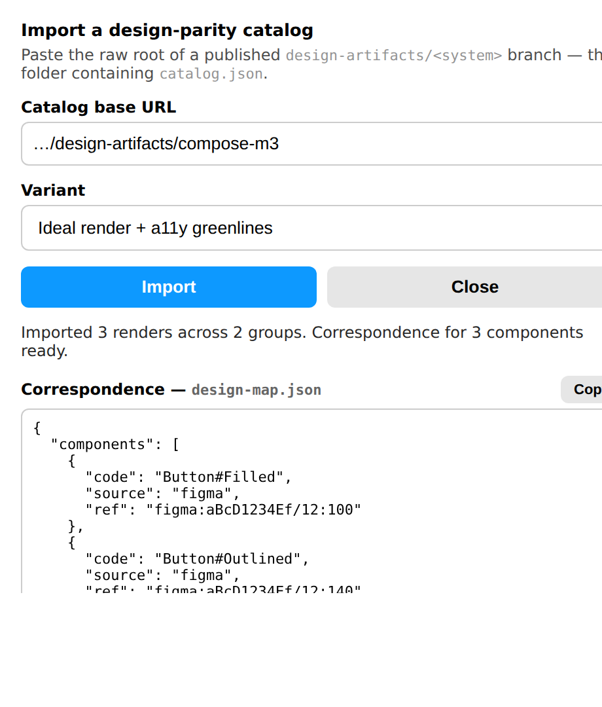

It's a **scaffold**: the plugin fills the authoritative half of each entry —
`source: "figma"` and `ref: figma:<fileKey>/<nodeId>` — but a catalog carries
only a `componentId`, not the `file#symbol` code handle the schema requires, so
`code` is derived from the componentId (`Button/Filled` → `Button#Filled`) and
meant to be reconciled with the consumer's real component handle. A sample is
committed at [`docs/design-map.sample.json`](docs/design-map.sample.json). When
the file isn't saved yet (`figma.fileKey` is null) the ref carries a `FILE_KEY`
placeholder the panel flags.

## Keeping evidence current

`planToSvg` is deterministic, so the committed `docs/canvas-preview*.svg` must
equal what the current code produces from
[`docs/sample-catalog.json`](docs/sample-catalog.json). A test
([`test/preview-evidence.test.ts`](test/preview-evidence.test.ts)) regenerates
them and fails if they drift — so any change to the planner / preview /
annotations that isn't reflected in the committed evidence is caught by
`npm test` in CI, forcing the PR to refresh its before/after proof. Regenerate
with:

```sh
npm run build --workspace @design-parity/figma-plugin
npm run preview --workspace @design-parity/figma-plugin   # rewrites the SVGs
```

then re-rasterize the PNGs (the generator prints the `chromium --screenshot`
command). Only the deterministic SVGs are gated; the PNGs are Chrome-rendered
and refreshed alongside by hand.

## Publishing to the Figma Community

Local install (above) covers everyone who just wants to *run* the plugin.
Listing it in the **Figma Community** is a separate, one-time-per-account manual
step — Figma has **no publish API or CLI**, so this can't be automated in CI, and
it **does require registration**:

1. **Register (get a plugin `id`).** The source `manifest.json` has no `id` — a
   Community plugin needs one, and only Figma can mint it. Import the manifest in
   the desktop app, then *Publish*; Figma generates the `id` (or shows a
   **Generate ID** button on an "Invalid ID" error). **Commit that `id` into
   [`figma/manifest.json`](figma/manifest.json)** so every future build carries
   it — updates are matched to the listing by `id`.
2. **Publish.** *Plugins → Manage plugins → (this plugin) → Publish*, or right on
   the manifest. Fill in the listing (name, description, icon, cover art) and
   the data-security self-assessment. The **first** submission goes through
   Figma's **review**; you're emailed the decision.
3. **Update.** After approval, publishing new versions is immediate — no
   re-review. Build the bundle (`npm run build:plugin`) and *Publish new
   version* against the same `manifest.json`.

Because publishing is human-in-Figma, CI's role is only to keep a reproducible,
reviewed bundle ready to upload — see the
[`figma-plugin-bundle`](../../.github/workflows/plugin-bundle.yml) workflow.

## Roadmap

- Generate true Code Connect (`*.figma.tsx`) rather than a design-map scaffold —
  needs each component's code import path, which the catalog doesn't yet carry.
