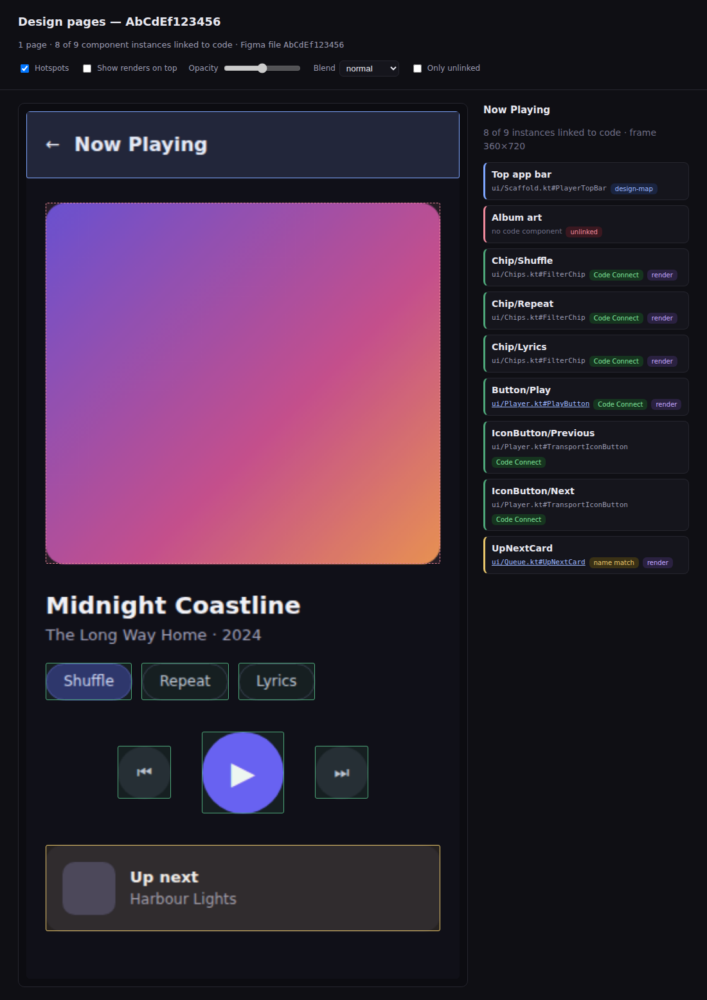
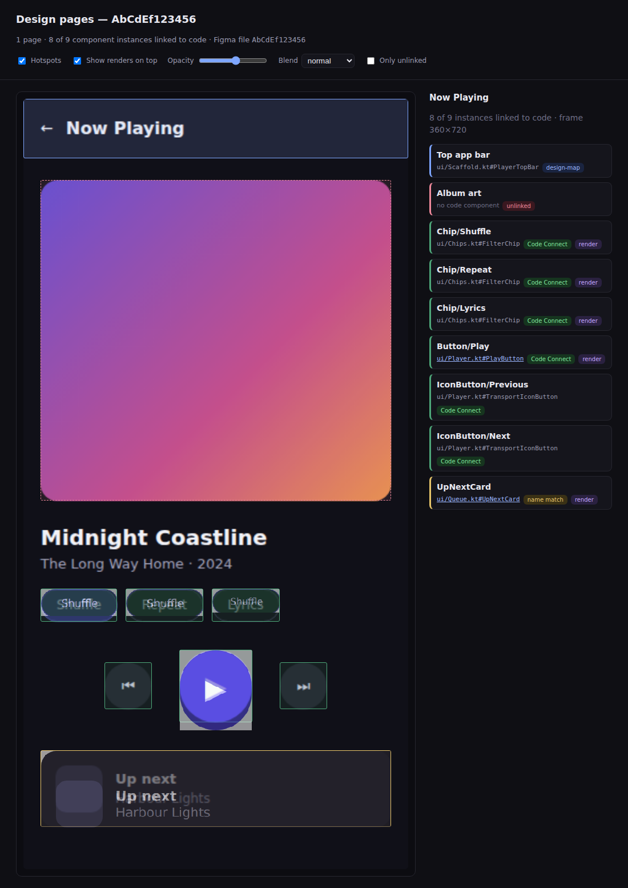
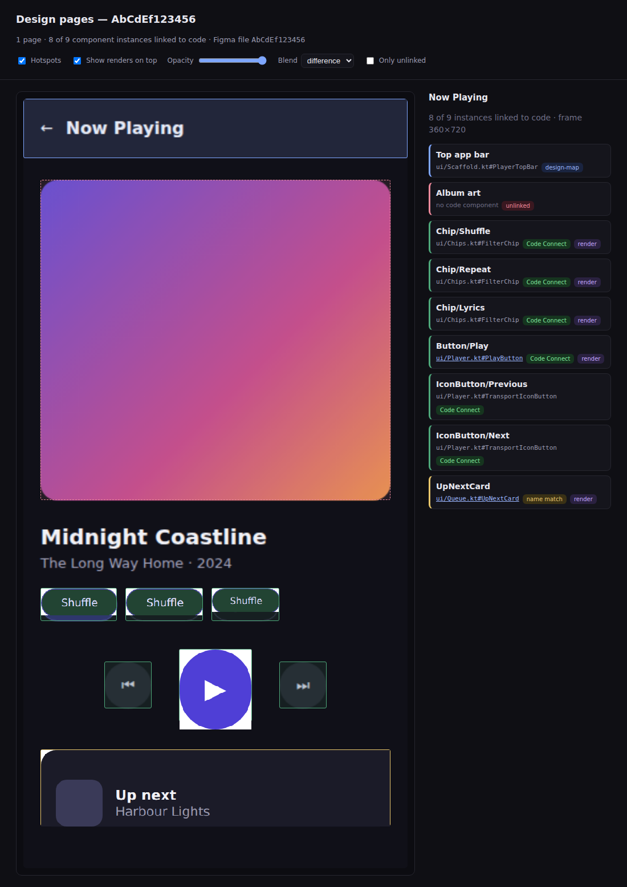

# `@design-parity/page-backdrop`

Import the **key pages** of a Figma file as backdrops, place every component
instance on them, link each one back to the code component that implements it,
and — optionally — show the code renders **on top of** the design.

Where the rest of design-parity asks *"does this Button match its Figma node?"*,
this asks the whole-screen question: **here is the Now Playing screen — which of
its parts do we implement, where, and do our renders sit right on top of the
design?**



> **Opt-in, off by default.** Nothing here runs unless a repo commits a
> `design-pages.json` with `"enabled": true` *and* someone invokes the
> `design-parity-pages` CLI. This package is not referenced by
> `@design-parity/action`, so the PR bot behaves identically whether or not a
> repo has adopted it. See [Turning it on](#turning-it-on).

## What you get

A committed `pages.json` plus one PNG per page, and a self-contained HTML viewer
built from them:

- **Backdrop** — the design page, exactly as Figma renders it.
- **Hotspots** — one rectangle per component instance, colour-coded by how it
  was linked: green Code Connect, blue `design-map.json`, amber name-match, and
  a dashed red outline for **unlinked** — a part of the screen with no code
  behind it, which is usually the most interesting thing on the page.
- **Links** — every linked placement carries its code handle, and can carry a
  URL you supply (source file, preview, wherever you want the click to land).
- **Overlay** — the code's own render laid over its placement, with an opacity
  slider and a `difference` blend. Starts **off**.

## Turning it on

Commit a `design-pages.json` at the repo root:

```jsonc
{
  "$schema": "./node_modules/@design-parity/page-backdrop/schema/page-backdrop-config.schema.json",
  "enabled": true,              // ← required; anything else leaves the feature off
  "fileKey": "AbCdEf123456",    // the segment after /design/ in the Figma URL
  "pages": [
    { "nodeId": "1:2", "id": "now-playing" },
    { "nodeId": "1:8" }         // id defaults to a slug of the frame's name
  ],
  "outDir": "design/pages"
}
```

Both halves of the gate are deliberate. **No file** means the feature has never
been heard of and nothing happens. **A file without `"enabled": true`** means
the configuration — which file, which frames, where the output goes — can be
landed and reviewed *before* anyone switches the feature on. Reviewing the
config never silently turns it on.

Optional keys: `backdrop` (`"png"` or `"svg"`, default `"png"` — see below),
`scale` (PNG export scale, default `2`), `nested` (record instances inside other
instances, default `false`), and `overlay` (`{ enabled, opacity, blend }`,
defaulting to off / `0.5` / `normal`).

## `"backdrop": "svg"` — a backdrop you can address

A PNG backdrop is a picture: the only way to say anything about a part of it is
to have recorded where that part was, and the only way to show a code render
against it is to lay one image over another and squint.

Exported with `svg_include_node_id`, the page comes back with `data-node-id` on
every element. That turns the backdrop into a **document**: given a placement's
node id, the element is right there. The viewer uses this to **cut the design
element out from under a code render** — a toggle that replaces the design's
button with yours, in the design's own layout, so a size or alignment difference
reads as a gap instead of a ghost. It also removes a second, weaker source of
truth, since an element's box is whatever the browser measures rather than a
number the manifest had to record and be trusted about.

The import refuses an export that came back without ids. A picture renders
perfectly well, so nothing downstream would report it — every placement would
quietly fail to find its element and the viewer would look like it worked.

`png` stays the default. It is the safe answer for a screen built from
photography and effects, where a vector export is large and can differ from what
the design tool itself draws. `svg` is the right answer for the component
specimen sheets a design kit is mostly made of — which is also the part of a kit
worth putting renders on top of, because a definition sheet is exactly the claim
a catalog is trying to reproduce.

## Using it

```bash
# What pages does the file have? This is where the node ids in `pages` come
# from, so it runs before there is a config to opt in with. One request.
design-parity-pages list --file ocdacdEsnHipMJD3egzxKb --slug material-3-kit

# Is it on for this repo? (safe to run anywhere — says so when it isn't)
design-parity-pages status

# Import the key pages. Needs FIGMA_TOKEN or FIGMA_OAUTH_TOKEN.
design-parity-pages import \
  --code-connect figma.connect.json \
  --design-map   design-map.json

# Build the viewer, with renders laid over the components you have them for.
design-parity-pages view \
  --render ui/Player.kt#PlayButton=build/previews/PlayButton.png \
  --source-url ui/Player.kt#PlayButton=https://github.com/me/app/blob/main/ui/Player.kt \
  --out design/pages/pages.html
```

`import` is the only step that touches the network, and it is meant to be a
deliberate "refresh the backdrops" commit — not something a check does on every
push. Everything downstream reads the committed manifest.

## How placements are linked

Same precedence as the per-component resolver, applied per instance: **Code
Connect → `design-map.json` → name convention → unlinked.** The page-specific
wrinkle is *which* ref gets looked up. A page holds **instances**, but a link is
attached to a **component** — usually the component *set* rather than one
variant of it. So each placement is tried against three refs, widest first:

1. the component **set** (`Button`) — where Code Connect normally lives
2. the **main component** (`Button/Primary`) — a per-variant connection
3. the **instance** itself — only a hand-written `design-map.json` would point
   at one, but if a repo did, it is honoured

A name match is always reported as `convention` and an *ambiguous* one is left
unlinked with a warning rather than guessed at.

## Reading the overlay



A render is pinned to its placement's **top-left corner and scaled to the
placement's width**, keeping its own aspect ratio. It deliberately does **not**
stretch to fill the box — a component that renders taller than its design slot
is a real finding, and stretching would hide exactly that drift. An overflowing
overlay means the heights disagree.

Switch the blend to `difference` and matching pixels go black, so only the drift
lights up:



In the shots above, three things are visible and all three are true: the play
button renders taller than its design slot, the Up-next card sits a few pixels
low, and one code component (`FilterChip`) legitimately backs three different
chip instances, so its single render appears three times.

## Coordinates

Placements are stored in **frame-local design units** (Figma dp), not image
pixels, with the frame's top-left as the origin. The viewer positions by ratio,
so re-exporting the backdrop at a different `scale` doesn't invalidate the
manifest and there is no density arithmetic anywhere.

## Trying it without Figma

`fixtures/page-backdrop/` is a real import of the screen shown above, with the
three renders that go over it — enough to build the viewer with no credentials
and no renderer. `packages/page-backdrop/test/fixture.test.ts` builds it on
every CI run.
